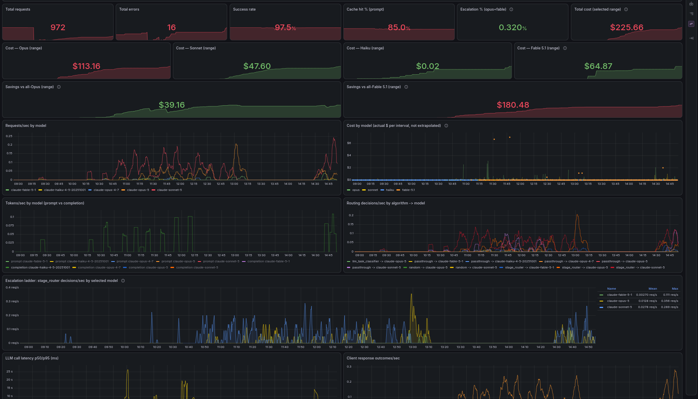

# switchyard-deploy

Deployment config for a local [NVIDIA NeMo Switchyard](https://github.com/NVIDIA-NeMo/Switchyard)
LLM router fronting Anthropic, plus a Prometheus + Grafana stack for it. Runs on
rootless Podman (Fedora / Bluefin) as systemd user services.

Two routers run side by side:

| Unit (systemd --user)          | Image                              | Port | Config                          | Role     |
|--------------------------------|------------------------------------|------|---------------------------------|----------|
| container-switchyard-main      | localhost/switchyard-server:main   | 4001 | deploy/routes.anthropic.toml    | default  |
| container-switchyard           | localhost/switchyard-server:0.2.0-cachefix | 4000 | deploy/v020/routes.anthropic.toml | fallback |

Both bind 127.0.0.1 only. The Anthropic key lives in `deploy/.env` (gitignored,
mode 600) and reaches the container through systemd `EnvironmentFile`; it is never
inlined in a unit or config file.



## Layout

```
deploy/routes.anthropic.toml        router config for main (classify_trigger schema)
deploy/v020/routes.anthropic.toml   same routes for the pinned v0.2.0 build (session_affinity schema)
deploy/.env.example                 ANTHROPIC_API_KEY template
deploy/logs/                        bind-mounted routing log (routing-main.jsonl), gitignored
systemd/                            the two container units
scripts/install-units.sh            copies units to ~/.config/systemd/user with paths rewritten to this checkout
bin/claude-sy                       Claude Code launcher pointed at the router
bin/switchyardctl                   status/routes/restart/logs for both routers
monitoring/                         podman-compose: Prometheus + Grafana, provisioned dashboard
patches/                            source patches applied to the images (see Build)
```

## Routes

| Route              | Type           | Behavior                                                        |
|--------------------|----------------|-------------------------------------------------------------------|
| top                | passthrough    | Opus 5 direct                                                   |
| smart              | stage_router   | Sonnet 5, escalates to Opus 5 on tool-loop trouble (default)    |
| smart_sonnet_fable | stage_router   | Sonnet 5, escalates to Fable 5.1 instead of Opus 5              |
| fable5             | passthrough    | Fable 5.1 direct (named `fable5`, not `fable`, to avoid a Claude Code alias collision) |
| front_door         | stage_router   | Sonnet 5, escalates to Opus 5 (identical to `smart`; entry point for the manual ladder below) |
| capable_escalate   | stage_router   | Opus 5, escalates to Fable 5.1 (second hop of the manual ladder) |
| judged             | llm_classifier | Haiku 4.5 judges once per session, picks Sonnet or Opus         |
| balanced           | random         | 50/50 Sonnet 5 / Opus 5 (A/B)                                   |
| haiku              | passthrough    | Haiku 4.5 direct; also the small-fast/background model          |

Main additionally exposes the raw model ids (`claude-opus-5`, `claude-sonnet-5`,
`claude-opus-4-7`, `claude-sonnet-4-6`) as passthrough aliases.

### Front door / capable escalate (manual 3-tier ladder)

Switchyard's `stage_router` supports exactly 2 tiers per route: a tier target
resolves straight to a model id, never to another route. There is no config
for a single route that escalates sonnet -> opus -> fable. `front_door` and
`capable_escalate` approximate that as two routes you hop between by hand:

1. Start a session on `front_door` (sonnet, escalates to opus on trouble signals,
   same behavior as `smart`).
2. If opus itself keeps struggling, switch mid-session to `capable_escalate`
   (`/model capable_escalate` in Claude Code). Its efficient tier is opus, not
   sonnet, so the session continues from where it was; its capable tier is
   Fable 5.1 for a further escalation.

Both hops still use the existing signal-driven trouble detection
(`confidence_threshold = 0.5`, tool-error patterns in
`crates/libsy/src/algorithms/util/tool_signals.rs` upstream). Nothing new
there, only the tier targets differ.

Schema note: the only config difference between the two builds is the `judged`
route: `session_affinity = true` (v0.2.0) became `classify_trigger = "new_session"`
(main). Validate a config against a build with `--dry-run`.

## Build

```sh
# main
git clone https://github.com/NVIDIA-NeMo/Switchyard.git ~/switchyard-main
cd ~/switchyard-main && podman build -f Dockerfile -t localhost/switchyard-server:main .

# v0.2.0 + patch 0001 (upstream #489: never add a 5th cache_control block)
git clone -b v0.2.0 https://github.com/NVIDIA-NeMo/Switchyard.git ~/switchyard
cd ~/switchyard && git apply /path/to/this/repo/patches/0001-*.patch
podman build -f Dockerfile -t localhost/switchyard-server:0.2.0-cachefix .
```

`patches/0002-*-UNAPPLIED.patch` adds `strict: true` to the OpenAI `json_schema`
translation. It is not in the running image; the haiku route was moved to the
native Anthropic client instead, which sidestepped the bug.

## Run

```sh
cp deploy/.env.example deploy/.env && chmod 600 deploy/.env   # paste the key
scripts/install-units.sh                                      # both units
systemctl --user enable --now container-switchyard-main.service container-switchyard.service
loginctl enable-linger "$USER"
switchyardctl status
```

Podman gotchas baked into the units:

- `:Z` on every bind mount (SELinux enforcing).
- `--userns=keep-id` so the container (uid 1000) can write the host-mounted routing
  log. Without it: `failed to initialize routing log ... Permission denied`.
- Config file must be 0644; the secret is in the env, not the file.
- `--host 0.0.0.0` inside the container, `-p 127.0.0.1:PORT:PORT` outside.
- `/v1/stats` counters reset on every restart. `deploy/logs/routing-main.jsonl` and
  Prometheus are the durable sources.

## Consumers

Claude Code:

```sh
claude-sy              # smart on :4001, auto permission mode, folder pre-trusted
claude-sy top          # other route
claude-sy --v020       # fallback router
claude-sy --list
```

Inside a session switch with `/model <route>` (typed; the picker only lists built-ins).
Env: `SWITCHYARD_ROUTE`, `SWITCHYARD_URL`, `SWITCHYARD_PERMISSION_MODE`
(default `auto`), `SWITCHYARD_AUTO_TRUST=0` to keep the trust dialog.

Hermes: register routes under the top-level `model_aliases:` key in
`~/.hermes/config.yaml` (not `model.aliases`, which only takes strings):

```yaml
model_aliases:
  sy-smart: {model: smart, provider: custom, base_url: http://127.0.0.1:4001/v1}
  sy-top:   {model: top,   provider: custom, base_url: http://127.0.0.1:4001/v1}
```

prime-agent: a `switchyard` provider in `~/.prime/agent/models.json` with
`baseUrl: http://127.0.0.1:4001/v1`, one model entry per route.

See "Using this with Hermes or prime-agent" below for a full provider block
covering every route.

## Using this with Hermes or prime-agent

The `model_aliases` and `models.json` snippets above are the minimum to get
one or two routes working. `examples/` has the fuller version: a whole
`providers.switchyard` block listing every route currently defined in
`deploy/routes.anthropic.toml`, in the exact shape each tool expects.

- `examples/hermes-config-snippet.yaml` goes under the top-level `providers:`
  key in `~/.hermes/config.yaml`. Merge it into your existing config rather
  than replacing the file.
- `examples/prime-agent-models-snippet.json` is a full `~/.prime/agent/models.json`
  (or the `providers.switchyard` part of one, if you already have other
  providers registered there).

Both point at `http://127.0.0.1:4001/v1`, the default address of the `main`
router from this repo. If you changed the port, run Switchyard on a
different host, or want the `v0.2.0` fallback router (`:4000`, fewer routes)
instead, edit the `base_url`/`baseUrl` field accordingly.

Neither file needs a real Anthropic API key. Switchyard holds the real key
server-side (in `deploy/.env`) and doesn't check inbound credentials, so the
`key_env`/`apiKey` fields just need to be present and non-empty; the value
itself is not checked. What each tool DOES need filled in before this works:

- Hermes: `key_env` names an environment variable, but that variable doesn't
  need to hold a real secret; export it as anything non-empty.
- prime-agent: the example already uses the placeholder value Switchyard's
  own launcher uses (`switchyard-no-auth-needed`, see `bin/claude-sy`); leave
  it as-is.

## Monitoring

```sh
cd monitoring
cp .env.example .env            # set GRAFANA_ADMIN_PASSWORD (compose refuses to start without it)
podman-compose up -d
```

Grafana http://YOUR_HOST_IP:3000, Prometheus http://YOUR_HOST_IP:9090, where
`YOUR_HOST_IP` is `127.0.0.1` if you're only accessing this from the same
machine, or your machine's LAN IP/hostname if you want to reach it from
elsewhere on your network. Both use `network_mode: host` because the routers
are loopback-only and unreachable from a bridge network.
`GRAFANA_BIND_ADDR=127.0.0.1` for local-only; for LAN access open 3000/9090 in
firewalld. Prometheus has no auth, so don't expose it beyond your LAN.

The provisioned "Switchyard Router" dashboard shows requests, success rate, cache
hit %, Opus escalation %, latency, and cost. Cost panels price tokens per model with
Anthropic's cache multipliers (cache write 1.25x input, cache read 0.1x input) and
use `increase()` over the selected range, so the dollar figures follow the time
picker instead of extrapolating an hourly rate. A "Savings vs all-Opus" panel
reprices the whole workload at Opus rates.

## Cost notes

Over ~680 Claude Code requests, Opus was ~6% of calls and ~60% of spend. The
`smart` stage_router escalates on a single trouble signal
(`confidence_threshold = 0.5`; a lone signal scores tanh(1) = 0.76). Escalated
Opus calls get ~0% cache reuse because Opus never sees consecutive same-prefix
turns. The lever is escalation frequency: raising the threshold to ~0.77 requires
two signals. Left at 0.5 on purpose.

## Key rotation

New key in the Anthropic Console, paste into `deploy/.env`, `switchyardctl main
restart`, confirm a 200, revoke the old key.
